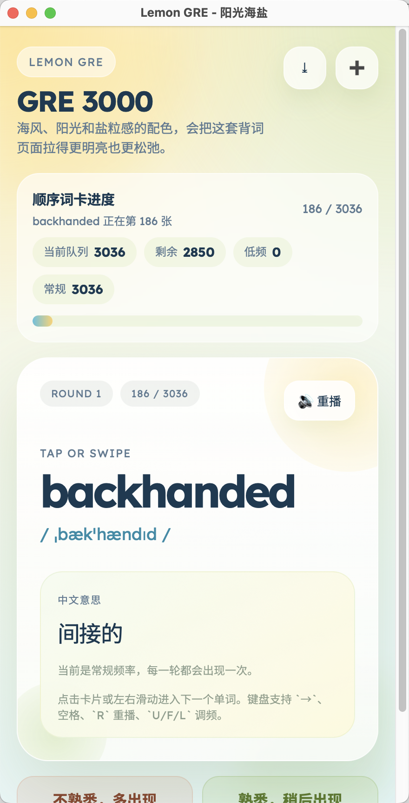

# 超轻量化 定制风格情绪 GRE 背单词 App

> Lemon GRE 是一个把 GRE 背词做成清爽小应用的背单词神器：一页一词、点击即读、熟词降频、低频召回，还能直接导入你自己的词表。
>
> 在线体验：<https://human-ai-factory.github.io/lemon-gre/>
>
> 下载 App：<https://github.com/Human-AI-Factory/lemon-gre/releases/tag/v0.1.0-preview>

打开 [index.html](./index.html) 就能直接用。

## 界面预览



现在已经内置了 [words_bank_raw/GRE_3000_Vocabularies/3000.xlsx](./words_bank_raw/GRE_3000_Vocabularies/3000.xlsx) 解析出的 `GRE 3000` 词库，首次打开后可以在空状态页或“批量添加词表”弹层里一键导入。

现在也支持安装成 PWA。用 `localhost` 打开后，Chrome / Edge / Safari 都可以添加到桌面或主屏幕，作为一个独立 app 使用。

如果你想让“导出音频”功能更稳定，建议用本地静态服务器打开：

```bash
cd lemon-gre
python3 -m http.server 4173
```

然后访问 `http://localhost:4173/index.html`。

如果你已经开过旧版本页面，但没看到新的“导入词表”按钮，先强制刷新一次；PWA / service worker 场景下旧页面可能被缓存。

说明：

- 单词数据保存在浏览器 `localStorage`
- 熟词会被降为低频词，并在后续轮次按低频重新出现
- 现在支持 `不熟悉 / 熟悉 / 太熟了` 三档调频：
  - `不熟悉`：本轮会再出现一次，之后保持每轮出现
  - `熟悉`：隔轮出现
  - `太熟了`：低频召回，约每 4 轮回来一次
- 现在支持把 `xlsx / xlsm / csv / txt` 直接拖进页面，自动识别词表并导入
- 导入时可以选择：
  - 新建一个词库
  - 继续扩充现有词库
  - 合并多个词库生成一个新词库
  - 按固定数量拆分一个词库
- 可以只学习某个词库，或者暂停某个词库，学习队列会跟着切换
- 内置词库数据文件是 [data/gre3000-bank.js](./data/gre3000-bank.js)
- 如果原始 Excel 更新了，可以执行 `python3 scripts/build_word_bank.py` 重新生成内置词库
- [words_bank_raw](./words_bank_raw) 已加入 [.gitignore](./.gitignore)，运行时不依赖它；如果你还要重新生成词库，保留本地原始 Excel 即可
- “导出音频”依赖浏览器的标签页录音能力，成功时会下载 `webm`
- 浏览器不支持录音时，会自动降级为导出今日朗读脚本

## 致谢

本项目内置的 `GRE 3000` 词库，来自本地原始目录 [words_bank_raw/GRE_3000_Vocabularies](./words_bank_raw/GRE_3000_Vocabularies) 中的 Excel 词表整理。

特别致谢：

- `GRE_3000_Vocabularies` 项目：<https://github.com/yuanjiaz/GRE_3000_Vocabularies>
- 上游原始项目 `3000`：<https://github.com/liurui39660/3000>
- 该词表在上游说明中标注的原始文件出处为 ChaseDream 论坛，再要你命 3000，作者为“我和葡萄”：<https://forum.chasedream.com/thread-702976-1-1.html>

词库内容版权和整理工作归原作者及相关整理者所有；本项目仅将其转换为适合本地背词应用使用的内置词库格式。
